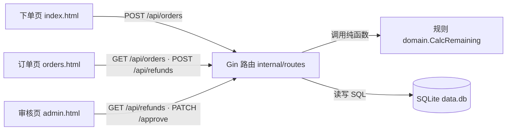

# code-map · refund-shop 代码库地图（S-A 第 1 步 · 新项目简化版样本）

> 给学员的第一份"项目长啥样"地图。六板块：架构 / 模块 / 入口 / 数据 / 依赖 / 风险。
> 对齐：vibeCoding 共享单元 S-A「第 1 步 探索既有代码库」。
> 读者打开顺序建议：先读本文件 → 再开 `key-files-quickref.md`（5 个关键文件速查）。

---

## §1. 架构总览（谁调谁）

- **前端**：三页纯静态 HTML + fetch，由 `main.go` 用 `go:embed` 打包，与后端同端口（3000），**无需单独起前端**。
- **路由层** `internal/routes`：接收 HTTP，解析 JSON，调用逻辑，把结果写回 JSON。
- **领域层** `internal/domain`：退款金额纯函数，不碰 I/O，可单测。
- **数据层** `internal/db`：SQLite 连接 + 建表。

## §2. 模块清单与职责

| 模块 | 文件 | 一句话职责 | 依赖谁 |
|---|---|---|---|
| 装配入口 | `main.go` | 连库、建路由、挂静态 | routes/db/gin |
| 订单路由 | `internal/routes/orders.go` | 下单/列表/详情 3 端点 | db/gin |
| 退款路由 | `internal/routes/refunds.go` | 申请/列表/审批 3 端点 | db/gin/domain |
| 退款规则 | `internal/domain/refund_rules.go` | `CalcRemaining` 算可退金额 | 无（纯函数） |
| 建表连接 | `internal/db/db.go` + `schema.sql` | 打开 SQLite + 建两表 | database/sql / modernc |

## §3. 入口 / 被测对象 / 下游依赖 / 隐藏依赖

- **入口**：`go run .` → `main.go` 第一行。
- **被测对象**：`orders.go` / `refunds.go`（http 集成测）；`refund_rules.go`（单元测）。
- **下游依赖**：路由层 → `domain.CalcRemaining`。
- **隐藏依赖**：`schema.sql` 的 CHECK 约束（易被忽略，却会拦截非法数据）。

## §4. 刻意留给教学的设计点（重要）

| 位置 | 类型 | 一句话 |
|---|---|---|
| `refund_rules.go` 顶部 3 处 TODO | B1① 模糊点 | 运费退法 / 用券返法 / 超额策略 |
| `orders.go` 下单 amount 边界 | B2 Bug1 | 0 元订单漏洞（b2-bug 分支触发） |
| `refund_rules.go` remaining 计算行 | B2 Bug2 | 累计退款减数写反（b2-bug 分支触发） |
| `orders/refunds` 多处 BindJSON 样板 | B3 坏味道 1 | Handler 三段式重复 |
| `schema.sql` 单文件两表 | B3 坏味道 2 | Schema 单文件混写 |
| `refund_rules.go` 大 if-else | B3 坏味道 3 | 规则函数过长 |

## §5. 常见风险 / 学习坑位

1. **金额用「分」整数**，别转浮点——前端显示才 /100。
2. `CHECK (amount > 0)` 拦截非法数据，改 SQL 时别顺手去掉。
3. 测试用 `:memory:` 库，别污染 `data.db`。
4. 改路由字段前先看 `api-reference.md`，保持契约稳定。

## §6. 数据类型 / 调用次数速记

- 两个核心结构体：`OrderReq` / `Order`（orders.go）；`RefundReq` / `Refund` / `ApproveReq`（refunds.go）。
- 关键调用点：路由层每个写操作后都 `fetchXxx(id)` 回读再返回，保证响应完整。